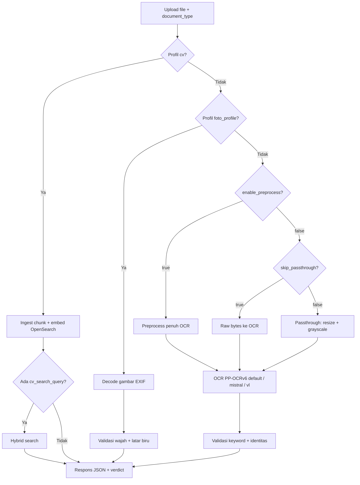
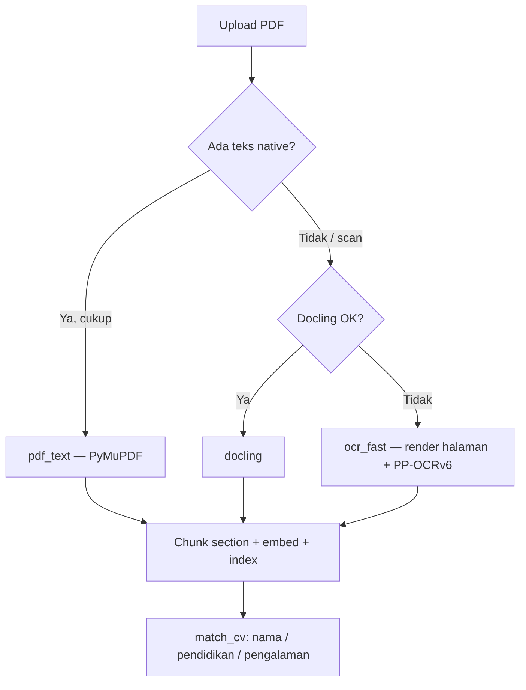

# OCR Platform

API preprocessing + OCR (PP-OCRv6) + validasi dokumen. **Cara utama: build di server** (linux/amd64 native). Jangan push image bergiga dari Mac ke Docker Hub.

## Install di server NVIDIA

```bash
git clone <repo> && cd ocr
# pertama kali (Paddle + dataset + CV deps, sekali):
REBUILD_BASE=1 bash scripts/server_build.sh
docker compose -f deploy/docker-compose.yml up -d
```

Update kode (tidak download Paddle/dataset ulang):

```bash
git pull
bash scripts/server_build.sh
docker compose -f deploy/docker-compose.yml up -d
```

RTX 50 (sm_120): `PADDLE_GPU_INDEX=cu129 PADDLE_VERSION=3.3.1 REBUILD_BASE=1 bash scripts/server_build.sh` — Paddle 3.2.x tidak mendukung arsitektur 120.

## Opsional: Docker Hub (dari server, bukan dari Mac)

```bash
docker login
export DOCKERHUB_USER=codemysister
REBUILD_BASE=1 VARIANT=gpu bash scripts/docker_push.sh   # sekali
VARIANT=gpu bash scripts/docker_push.sh                    # harian
```

UI/API produksi: [https://checkinpro-ocr.web.id/pipeline](https://checkinpro-ocr.web.id/pipeline) — Swagger: [https://checkinpro-ocr.web.id/docs](https://checkinpro-ocr.web.id/docs)

Spesifikasi API & integrasi: [bagian API di README ini](#api--spesifikasi--cara-penggunaan).

Inferensi pertama mengunduh model Paddle ke volume `paddle-models` (bisa beberapa menit).

## Lokal (masih pakai image)

```bash
docker compose up -d --build
```

Set `OCR_IMAGE=akunanda/ocr:latest` di `.env` jika ingin pull, bukan build.

## Catatan

- Tag `:latest` = **CPU**. Tag `:gpu` = **Paddle CUDA** (tidak perlu pip ulang di server).
- Dua tag: `:gpu-base` (Paddle + dataset, jarang) dan `:gpu` (kode, harian). Server cukup `docker pull …:gpu`; layer base tidak diunduh ulang.
- `REBUILD_BASE=1` jika `requirements.txt`, `requirements-cv.txt`, wheel Paddle, atau `dataset/` berubah.
- Benchmark `/dataset-test` memakai `dataset/` di dalam image. Jangan mount volume kosong ke `/app/dataset`.
- Key opsional (Mistral, dll.): file `.env` di samping compose.
- **CV upload:** subsistem CV (`requirements-cv.txt`) sudah termasuk di image base. `deploy/docker-compose.yml` juga menjalankan OpenSearch. Cek: `GET /health` → `cv_search: true`.

---

# API — spesifikasi & cara penggunaan

## Base URL & cara penggunaan

| Lingkungan | Base URL |
|------------|----------|
| **Produksi** | `https://checkinpro-ocr.web.id` |
| Lokal (dev) | `http://127.0.0.1:8001` (env `PORT`) |

Dokumentasi interaktif (Swagger): [https://checkinpro-ocr.web.id/docs](https://checkinpro-ocr.web.id/docs)

UI pipeline: [https://checkinpro-ocr.web.id/pipeline](https://checkinpro-ocr.web.id/pipeline) · Benchmark dataset: [https://checkinpro-ocr.web.id/dataset-test](https://checkinpro-ocr.web.id/dataset-test)

### Quick start — validasi dokumen (disarankan)

Satu request **multipart** untuk upload gambar/PDF → OCR → validasi:

```bash
curl -X POST "https://checkinpro-ocr.web.id/api/v1/pipeline" \
  -F "file=@KTP_Siti.jpg" \
  -F "document_type=KTP" \
  -F "expected_name=Siti Dwi Sarah"
```

**Baca respons:**

| Field | Arti |
|-------|------|
| `success` | Request diproses tanpa error fatal |
| `document_matched` | Semua gate validasi lolos |
| `valid` | Sama dengan `document_matched` (alias untuk `foto_profile` / `cv`) |
| `verdict.summary` | Ringkasan bahasa Indonesia |
| `verdict.is_own_document` | `true` / `false` / `null` (null jika `expected_name` kosong) |

**Contoh JavaScript (fetch):**

```javascript
const API_BASE = "https://checkinpro-ocr.web.id";

const form = new FormData();
form.append("file", fileInput.files[0]);
form.append("document_type", "ktp");
form.append("expected_name", "Bagus Junda Winata");

const res = await fetch(`${API_BASE}/api/v1/pipeline`, {
  method: "POST",
  body: form,
});
const data = await res.json();

if (!res.ok) {
  console.error(data.detail ?? data);
} else if (data.document_matched) {
  console.log("Lolos:", data.verdict.summary);
} else {
  console.log("Gagal:", data.validation?.explanation?.detail_lines);
}
```

### Health check

```bash
curl -s "https://checkinpro-ocr.web.id/health" | jq .
curl -s "https://checkinpro-ocr.web.id/api/v1" | jq '.document_types'
```

### CV (curriculum vitae)

```bash
curl -X POST "https://checkinpro-ocr.web.id/api/v1/pipeline" \
  -F "file=@cv_Andika.pdf" \
  -F "document_type=cv" \
  -F "expected_name=Andika Pratama"
```

Respons: `validation_mode: "cv"`, `cv_match.matched`, `cv_match.dimensions` (nama / pendidikan / pengalaman).

### Foto profil (pas foto biru)

```bash
curl -X POST "https://checkinpro-ocr.web.id/api/v1/pipeline" \
  -F "file=@pas_foto.jpg" \
  -F "document_type=foto_profile"
```

Baca field **`valid`** (`true` = VALID). Tidak ada OCR.

---

**Engine OCR default pipeline:** **PP-OCRv6** lokal (`ocr_mode=fast`, tier `medium`). Mode `mistral` (cloud) dan `vl` (PaddleOCR-VL) opsional lewat query `ocr_mode`.

---

## Daftar isi

1. [Konsep umum](#konsep-umum)
2. [Endpoint ringkas](#endpoint-ringkas)
3. [Pipeline utama (disarankan)](#pipeline-utama-disarankan)
4. [Profil dokumen & ketentuan validasi](#profil-dokumen--ketentuan-validasi)
5. [Endpoint per subsistem](#endpoint-per-subsistem)
6. [Struktur respons & verdict](#struktur-respons--verdict)
7. [Kode error](#kode-error)
8. [Variabel lingkungan](#variabel-lingkungan)

---

## Konsep umum

### `document_type`

String yang dikirim klien untuk menentukan **profil validasi**. Server menormalisasi ke ID kanonik (case-insensitive, alias didukung).

| ID kanonik | Label | Mode validasi |
|------------|-------|---------------|
| `ktp` | KTP | OCR + keyword fuzzy |
| `npwp` | NPWP | OCR + keyword fuzzy |
| `kk` | Kartu Keluarga | OCR + keyword fuzzy |
| `rekening` | Rekening | OCR + keyword fuzzy |
| `mutasi` | Mutasi | OCR + keyword fuzzy |
| `skck` | SKCK | OCR + keyword fuzzy |
| `bpjs` | BPJS Kesehatan (KIS) | OCR + keyword fuzzy + identitas |
| `bpjs_tk` | BPJS Ketenagakerjaan | OCR + keyword AND/OR + identitas |
| `bpjs_kesanggupan` | Kesanggupan BPJS Kesehatan | OCR + keyword AND/OR + identitas |
| `jkn` | JKN (Info Peserta) | OCR + keyword OR + identitas |
| `iuran` | Iuran JKN (Info Iuran) | OCR + keyword AND/OR + identitas |
| `vaksinasi_1` | Vaksinasi COVID-19 (Dosis 1) | OCR + keyword AND/OR + identitas |
| `vaksinasi_2` | Vaksinasi COVID-19 (Dosis 2) | OCR + keyword AND/OR + identitas |
| `vaksinasi_3` | Vaksinasi COVID-19 (Dosis 3 / Booster) | OCR + keyword AND/OR + identitas |
| `ijasah` | Ijazah | OCR + keyword fuzzy |
| `transkrip` | Transkrip Nilai | OCR + keyword fuzzy |
| `formulir_okb` | Formulir OKB | OCR + keyword fuzzy |
| `formulir_lamaran` | Formulir Lamaran Pekerjaan | OCR + keyword fuzzy |
| `surat_lamaran` | Surat Lamaran | OCR + keyword fuzzy |
| `pemadanan_npwp` | Pemadanan NPWP | OCR + keyword fuzzy |
| `keterangan_kesehatan` | Surat Keterangan Kesehatan | OCR + keyword fuzzy |
| `foto_profile` | Foto Profil | **Gambar** (wajah + latar biru) |
| `cv` | CV | **Ingest + match** 3 dimensi (nama / pendidikan / pengalaman) — bukan validasi OCR keyword |

Daftar lengkap alias ada di [Profil dokumen](#profil-dokumen--ketentuan-validasi).

### Gate validasi (dokumen teks/OCR)

Untuk profil selain `foto_profile`:

```
document_matched = document_type_pass AND (expected_name kosong ATAU identity_pass)
```

| Gate | Default | Arti |
|------|---------|------|
| `document_type_pass` | aggregate ≥ **70%** | Rata-rata skor fuzzy keyword profil vs teks OCR |
| `identity_pass` | skor ≥ **65** | Nama diekstrak dari OCR vs `expected_name` (hanya jika nama diisi) |

Skor identitas = rata-rata `token_sort_ratio`, `WRatio`, `partial_ratio` (RapidFuzz).

### Gate validasi (`foto_profile`)

```
valid = document_matched = face_pass AND blue_background_pass
```

**Tidak ada OCR.** Respons inti cukup field `valid` (boolean). Detail teknis ada di `image_validation` bila perlu debugging. Lihat [Foto Profil](#foto_profile).

### Field penting di respons

| Field | Tipe | Keterangan |
|-------|------|------------|
| `success` | boolean | Request diproses |
| `document_matched` | boolean | Semua gate relevan lolos |
| **`valid`** | boolean | **`foto_profile`:** alias langsung `document_matched` — **VALID / TIDAK VALID** |
| `verdict.summary` | string | Ringkasan bahasa Indonesia |
| `verdict.is_own_document` | bool \| null | `null` jika `expected_name` kosong |
| `verdict.document_type_current` | string \| null | Profil terdeteksi dari OCR/gambar |
| `validation_mode` | `"ocr"` \| `"image"` \| `"cv"` | `"image"` untuk `foto_profile`; `"cv"` untuk ingest CV |

### Engine OCR (`ocr_mode`)

| Nilai | Engine | Keterangan |
|-------|--------|------------|
| **`fast`** (default) | **PP-OCRv6** lokal | Tidak butuh API key; tier lewat `pp_ocr_tier` (default `medium`) |
| `mistral` | Mistral OCR cloud | Butuh `MISTRAL_API_KEY`; mendukung `document_annotation` untuk nama |
| `vl` | PaddleOCR-VL lokal | Layout parsing; set `full_json=true` untuk JSON penuh |

---

## Endpoint ringkas

| Method | Path | Content-Type | Fungsi |
|--------|------|--------------|--------|
| **POST** | **`/api/v1/pipeline`** | **multipart** | **OCR → validasi (1 request)** |
| GET | `/health` | — | Health check platform |
| GET | `/api/v1` | — | Daftar endpoint & `document_types` |
| GET | `/llm-fallback-log` | — | UI log fallback AI (dev/QA) |
| GET/DELETE | `/api/v1/llm-fallback-logs` | — | API log fallback AI (JSON) |
| POST | `/api/v1/preprocess` | multipart | Preprocess gambar saja |
| POST | `/systems/ocr/api/v1/ocr-mistral` | multipart | OCR cloud Mistral (opsional) |
| POST | `/systems/ocr/api/v1/ocr-fast` | multipart | **OCR lokal PP-OCRv6 (default pipeline)** |
| POST | `/systems/ocr/api/v1/ocr` | multipart | OCR lokal PaddleOCR-VL |
| POST | `/systems/validation/api/v1/validate-document` | JSON | Validasi teks OCR vs profil |
| POST | `/systems/validation/api/v1/validate-foto-profile` | multipart | Validasi foto profil biru (tanpa pipeline) |
| POST | `/systems/validation/api/v1/compare-names` | JSON | Bandingkan dua string nama |
| POST | `/systems/cv/api/v1/ingest` | multipart | Ingest CV (PDF/DOCX/MD/gambar) → OpenSearch |
| POST | `/systems/cv/api/v1/match` | JSON | Match CV terindeks (nama / pendidikan / pengalaman) |
| GET | `/systems/cv/api/v1/documents` | — | Daftar CV terindeks |
| DELETE | `/systems/cv/api/v1/documents/{doc_id}` | — | Hapus CV dari index |
| GET | `/api/v1/dataset/types` | — | Daftar folder `dataset/` + pemetaan `document_type` |
| GET | `/api/v1/dataset/file` | — | Preview/unduh file dataset (`folder` + `file` query) |
| POST | `/api/v1/dataset/benchmark` | JSON | Benchmark pipeline terhadap file dataset (NDJSON stream) |
| GET | `/dataset-test` | — | UI benchmark dataset (dev): mode batch atau file spesifik |

---

## Pipeline utama (disarankan)

Satu request untuk upload gambar → validasi. Paling cocok untuk form upload di frontend.

### Request

```
POST /api/v1/pipeline
Content-Type: multipart/form-data
```

**Form fields**

| Field | Wajib | Keterangan |
|-------|-------|------------|
| `file` | ✅ | Gambar dokumen (JPEG, PNG, WebP, PDF page, dll.) |
| `document_type` | ✅ | ID kanonik atau alias, mis. `KTP`, `foto_profile` |
| `expected_name` | — | Nama referensi user; kosong = skip cek identitas |

**Query parameters**

| Param | Default | Keterangan |
|-------|---------|------------|
| `ocr_mode` | **`fast`** | **`fast`** = PP-OCRv6 lokal (default) \| `mistral` \| `vl` — **diabaikan untuk `foto_profile`** |
| `pp_ocr_tier` | `medium` | Tier PP-OCRv6 saat `ocr_mode=fast` (default): `balanced` \| `medium` \| `small` \| `tiny` |
| `include_preprocessed_image` | `false` | Sertakan `preprocessed_image.image_base64` |
| `enable_preprocess` | **`false`** | `true` = crop/rotate/enhance penuh sebelum OCR; `false` = passthrough ringan atau raw (lihat di bawah) |
| `skip_passthrough` | **`false`** | `true` = kirim bytes upload **langsung** ke OCR (tanpa resize/grayscale). Hanya efektif bila `enable_preprocess=false` |
| `full_json` | `false` | Hanya `ocr_mode=vl`: lampirkan `result_json` penuh |
| `cv_search_query` | — | Hanya `document_type=cv`: kata kunci hybrid search (legacy alias `expected_name`) |
| `cv_education_query` | — | Hanya `document_type=cv`: filter tambahan section pendidikan |
| `cv_experience_query` | — | Hanya `document_type=cv`: filter tambahan section pengalaman |

Tanpa query `ocr_mode`, pipeline memakai **PP-OCRv6** (`fast`) dengan tier **`medium`**.

### Preprocessing (`enable_preprocess` & `skip_passthrough`)

| Kombinasi | Perilaku |
|-----------|----------|
| default (`enable_preprocess=false`, `skip_passthrough=false`) | **Passthrough ringan:** decode EXIF → upscale/downscale (`PREPROCESS_MIN_SIDE_TARGET`) → **grayscale 8-bit** → OCR |
| `skip_passthrough=true` | **Raw ke OCR:** bytes upload diteruskan apa adanya (hanya dicek bisa didecode). Tanpa EXIF rotate, resize, atau grayscale |
| `enable_preprocess=true` | **Preprocess penuh:** resize, orientasi NPWP, dual-crop (bila perlu), warp kartu (env), enhance grayscale, lalu OCR. `skip_passthrough` **diabaikan** |

Metadata `preprocess` saat passthrough ringan (default):

| Field | Arti |
|-------|------|
| `skipped` | `true` |
| `light_upscale_only` | `true` |
| `grayscale_applied` | `true` |
| `encoding` | `grayscale_8bit_passthrough` |
| `resize_applied`, `resize_scale`, `resize_reason` | Info upscale/downscale |
| `resize_min_side_target_boosted` | `true` bila thumbnail kecil (<500px) naik target efektif otomatis |

Metadata `preprocess` saat `skip_passthrough=true`:

| Field | Arti |
|-------|------|
| `skipped` | `true` |
| `skip_passthrough` | `true` |
| `reason` | `direct_upload_bytes` |
| `encoding` | `raw_upload_bytes` |
| `mime` | MIME terdeteksi dari magic bytes upload |
| `input_bytes` | Ukuran file upload (byte) |

**Tips:** Thumbnail upload kecil (~300–500px) sering butuh upscale agresif; set `PREPROCESS_MIN_SIDE_TARGET=900` (atau lebih) di server. NPWP/portrait rumit tetap bisa butuh `enable_preprocess=true`.

### Contoh — KTP + cek nama (default PP-OCRv6)

```bash
curl -X POST "https://checkinpro-ocr.web.id/api/v1/pipeline" \
  -F "file=@KTP_Siti.jpg" \
  -F "document_type=KTP" \
  -F "expected_name=Siti Dwi Sarah"
```

### Contoh — KTP + raw ke OCR (tanpa passthrough)

```bash
curl -X POST "https://checkinpro-ocr.web.id/api/v1/pipeline?skip_passthrough=true" \
  -F "file=@KTP_scan_1200px.jpg" \
  -F "document_type=KTP" \
  -F "expected_name=Siti Dwi Sarah"
```

### Contoh — KTP + preprocess penuh (crop kartu)

```bash
curl -X POST "https://checkinpro-ocr.web.id/api/v1/pipeline?enable_preprocess=true" \
  -F "file=@KTP_foto_meja.jpg" \
  -F "document_type=KTP" \
  -F "expected_name=Siti Dwi Sarah"
```

### Contoh — KTP + Mistral OCR (opsional)

```bash
curl -X POST "https://checkinpro-ocr.web.id/api/v1/pipeline?ocr_mode=mistral" \
  -F "file=@KTP_Siti.jpg" \
  -F "document_type=KTP" \
  -F "expected_name=Siti Dwi Sarah"
```

### Contoh — Foto profil biru (tanpa OCR)

```bash
curl -X POST "https://checkinpro-ocr.web.id/api/v1/pipeline" \
  -F "file=@pas_foto.jpg" \
  -F "document_type=foto_profile"
```

Query `ocr_mode`, `enable_preprocess`, dan `pp_ocr_tier` **diabaikan** untuk profil ini. Lihat [Foto profil (`foto_profile`)](#foto_profile).

### Contoh — CV PDF + match nama

```bash
curl -X POST "https://checkinpro-ocr.web.id/api/v1/pipeline?cv_education_query=S1%20Teknik%20Informatika&cv_experience_query=Python%20backend" \
  -F "file=@dataset/cv/cv_Usep_Maulidin.pdf" \
  -F "document_type=cv" \
  -F "expected_name=Usep Maulidin"
```

Query CV (semua **query string**, bukan form field):

| Param | Fungsi |
|-------|--------|
| `cv_search_query` | Legacy alias `expected_name` untuk nama |
| `cv_education_query` | Kata kunci tambahan section pendidikan |
| `cv_experience_query` | Kata kunci tambahan section pengalaman |

Respons: `validation_mode: "cv"`, `cv_ingest`, `cv_match`. Detail PDF & gate match → [CV (`cv`)](#cv).

### Contoh — JavaScript (fetch)

```javascript
const API_BASE = "https://checkinpro-ocr.web.id";

const form = new FormData();
form.append("file", fileInput.files[0]);
form.append("document_type", "ktp");
form.append("expected_name", "Bagus Junda Winata");

const res = await fetch(`${API_BASE}/api/v1/pipeline`, {
  method: "POST",
  body: form,
});
const data = await res.json();

if (data.document_matched) {
  console.log(data.verdict.summary);
} else {
  console.log(data.validation.explanation.detail_lines);
}
```

### Alur internal



---

## Profil dokumen & ketentuan validasi

### Ringkasan per case

| Profil | `document_type` contoh | Wajib isi `expected_name`? | OCR? | Lolos jika |
|--------|------------------------|----------------------------|------|------------|
| KTP | `ktp`, `KTP`, `identitas` | Opsional (disarankan untuk cek milik) | ✅ | Keyword KTP ≥70% **dan** (nama kosong **atau** identitas ≥65) |
| NPWP | `npwp`, `NPWP` | Opsional | ✅ | Keyword NPWP ≥70% **dan** identitas (jika dicek) |
| KK | `kk`, `kartu keluarga` | Opsional | ✅ | Keyword KK ≥70%; nama bisa dari baris tabel anggota |
| Rekening | `rekening`, `rekening tabungan` | Opsional | ✅ | Ada `tabungan`, **tidak** ada `e-statement`; opsional `expected_bank` (`mandiri` \| `mas`) |
| Mutasi | `mutasi`, `e-statement` | Tidak dipakai | ✅ | Ada `tabungan` **dan** `e-statement` (tanpa cek nama) |
| SKCK | `skck` | Opsional | ✅ | Ada `skck` / `kepolisian` |
| BPJS KIS | `bpjs`, `bpjs kesehatan`, `kartu indonesia sehat` | **Disarankan wajib** | ✅ | Keyword KIS ≥70% **dan** identitas (jika nama diisi) |
| BPJS TK | `bpjs_tk`, `bpjs ketenagakerjaan` | **Disarankan wajib** | ✅ | Keyword kartu TK ≥70% **dan** identitas (jika nama diisi) |
| Kesanggupan BPJS | `bpjs_kesanggupan`, `kesanggupan bpjs` | **Disarankan wajib** | ✅ | Surat kesanggupan ≥70% **dan** identitas (jika nama diisi) |
| JKN | `jkn`, `info peserta` | **Disarankan wajib** | ✅ | Ada `info peserta` **atau** `faskes` **dan** identitas ≥65 (jika nama diisi) |
| Iuran JKN | `iuran`, `info iuran`, `iuran jkn` | **Disarankan wajib** | ✅ | Ada `info iuran` **dan** (salah satu keyword konten) **dan** identitas (modal tanpa nama: skip) |
| Vaksinasi 1 | `vaksinasi_1`, `vaksinasi 1`, `vaksin dosis pertama` | **Disarankan wajib** | ✅ | Kartu/surat dosis 1 ≥70% **dan** identitas (jika nama diisi) |
| Vaksinasi 2 | `vaksinasi_2`, `vaksinasi 2` | **Disarankan wajib** | ✅ | Kartu/surat dosis 2 ≥70% **dan** identitas (jika nama diisi) |
| Vaksinasi 3 | `vaksinasi_3`, `vaksinasi 3`, `vaksin booster` | **Disarankan wajib** | ✅ | Kartu/surat dosis 3/booster ≥70% **dan** identitas (jika nama diisi) |
| Ijazah | `ijasah`, `ijazah` | Opsional | ✅ | Keyword ijazah/pendidikan ≥70% |
| Transkrip | `transkrip`, `transkrip nilai` | Opsional | ✅ | Keyword transkrip/nilai ≥70% |
| Formulir OKB | `formulir_okb`, `formulir okb` | Opsional | ✅ | Keyword formulir OKB ≥70% |
| Formulir lamaran | `formulir_lamaran`, `formulir lamaran pekerjaan` | Opsional | ✅ | Keyword lamaran pekerjaan ≥70% |
| Surat lamaran | `surat_lamaran`, `surat lamaran` | Opsional | ✅ | Keyword surat lamaran ≥70% |
| Pemadanan NPWP | `pemadanan_npwp`, `pemadanan npwp` | Opsional | ✅ | Keyword pemadanan/npwp ≥70% |
| Surat keterangan kesehatan | `keterangan_kesehatan`, `keterangan kesehatan` | Opsional | ✅ | Keyword surat keterangan/kesehatan ≥70% |
| CV | `cv`, `resume`, `curriculum vitae` | Disarankan (dimensi nama) | ❌ (match struktural) | **PDF/DOCX/MD/gambar** → ingest + match nama/pendidikan/pengalaman |
| Foto Profil | `foto_profile`, `pas foto` | Tidak dipakai | ❌ | **JPEG/PNG/WebP** — 1 wajah + latar biru |

---

### `ktp`

**Alias:** `kartu tanda penduduk`, `id card`, `identitas`

**Keyword yang dicek (fuzzy, rata-rata ≥70%):**

- `nik`, `nama`, `provinsi`, `kabupaten`, `agama`, `kewarganegaraan`, `status perkawinan`

**Bonus skor (structural):**

- NIK 16 digit di OCR
- Kata `nik`

**Identitas:** Ekstraksi nama dari baris `Nama` di OCR; prioritas `holder_name` dari Mistral `document_annotation` bila `ocr_mode=mistral`.

**Tips upload:** Foto kartu fisik — set `PREPROCESS_CARD_WARP=1` agar kartu terisolasi dari latar.

```bash
curl -X POST "https://checkinpro-ocr.web.id/api/v1/pipeline" \
  -F "file=@KTP.jpg" \
  -F "document_type=ktp" \
  -F "expected_name=Nama Lengkap Sesuai KTP"
```

---

### `npwp`

**Alias:** `nomor pokok wajib pajak`, `npwp 16 digit`

**Keyword (fuzzy, rata-rata ≥70%):** `npwp`, `pajak`, `kantor pelayanan`, `pratama`

**Bonus struktural:** marker NPWP (`npwp` / variasi OCR), nomor 15–16 digit, `kantor pelayanan`, `pratama`, `kpp`, `djp`.

**Anchor jenis dokumen:** Bila keyword aggregate <70% tetapi OCR punya **marker NPWP** + **nomor pajak 15–16 digit**, `document_type_pass` tetap lolos.

**Identitas:** Ekstraksi nama dari baris kapital dekat nomor NPWP; prioritas `holder_name` dari Mistral bila `ocr_mode=mistral`.

**Fallback NIK:** Pipeline mengisi `expected_nik` dari **16 digit di filename** (`{tipe}_{Nama}_{NIK16}.ext`). Bila nama OCR gagal tapi NIK 16 digit di OCR cocok dengan filename, `identity_pass` lolos (`npwp_nik_fallback`).

**Preprocess:** Thumbnail landscape kecil — passthrough ringan + upscale sering cukup; foto miring/portrait dual-crop → `enable_preprocess=true`.

```bash
curl -X POST "https://checkinpro-ocr.web.id/api/v1/pipeline" \
  -F "file=@NPWP.jpg" \
  -F "document_type=npwp" \
  -F "expected_name=Nama Wajib Pajak"
```

---

### `kk`

**Alias:** `kartu keluarga`

**Keyword:** `kartu keluarga`, `kepala keluarga`, `nik`

**Identitas khusus:** Bila nama referensi diisi, sistem juga memindai **baris tabel anggota** KK (bukan hanya kepala keluarga).

```bash
curl -X POST "https://checkinpro-ocr.web.id/api/v1/pipeline" \
  -F "file=@KK.jpg" \
  -F "document_type=kk" \
  -F "expected_name=Anggota Keluarga"
```

---

### `rekening`

**Alias:** `rekening koran`, `rekening tabungan`

**Keyword wajib:** `tabungan`

**Keyword terlarang (gagal jika terdeteksi):** `e-statement`

**Validasi bank (opsional):** kirim `expected_bank=mandiri` atau `expected_bank=mas` — sistem memeriksa teks/logo/nomor rekening di OCR.

| Bank | Sinyal OCR umum | Pola no. rekening |
|------|-----------------|-------------------|
| **Mandiri** | `livin`, `bank mandiri`, `detail rekening` | **13 digit** (awalan `156`, `173`, `166`, …) |
| **MAS** | `bank mas`, `mas saving`, `bebaspoin` | **10 digit** (umumnya awalan `100`) |

> Rekening tabungan biasa ≠ mutasi/e-statement. Jika OCR mengandung `e-statement`, profil `rekening` **ditolak**.

```bash
curl -X POST "https://checkinpro-ocr.web.id/api/v1/pipeline" \
  -F "file=@Rekening_Mandiri.jpg" \
  -F "document_type=rekening" \
  -F "expected_bank=mandiri" \
  -F "expected_name=Reva Wulan Rahmawati"
```

Respons validasi menyertakan `bank_detection` dan `bank_pass` (bila `expected_bank` diisi).

---

### `mutasi`

**Alias:** `mutasi rekening`, `e-statement`

**Keyword wajib (keduanya):** `tabungan`, `e-statement`

**Identitas:** `expected_name` **tidak** dicek untuk profil mutasi — hanya keyword dokumen.

```bash
curl -X POST "https://checkinpro-ocr.web.id/api/v1/pipeline" \
  -F "file=@Mutasi.jpg" \
  -F "document_type=mutasi"
```

---

### `skck`

**Alias:** `surat keterangan catatan kepolisian`

**Keyword:** `skck`, `kepolisian`

```bash
curl -X POST "https://checkinpro-ocr.web.id/api/v1/pipeline" \
  -F "file=@SKCK.jpg" \
  -F "document_type=skck" \
  -F "expected_name=Nama Pemohon"
```

---

---

### `bpjs`

**Alias:** `bpjs kesehatan`, `kartu indonesia sehat`, `kis`, `kartu kis`

**Dokumen:** Kartu Indonesia Sehat (KIS) — kartu fisik/digital BPJS Kesehatan.

**Keyword (fuzzy, rata-rata ≥70%):**

- `kartu indonesia sehat`, `bpjs kesehatan`, `nomor kartu`, `nik`, `faskes`, `syarat dan ketentuan`

**Identitas:** Ekstraksi nama dari label `Nama` atau baris huruf kapital di kartu; dibandingkan dengan `expected_name` bila diisi.

**Keyword terlarang (exclusion):** `info iuran`, `kepesertaan terdaftar`, `kartu vaksinasi covid`, `vaksin booster`, `bpjs ketenagakerjaan`, `ketenagakerjaan`

**Preprocess:** Foto kartu fisik — gunakan isolasi kartu seperti KTP (`PREPROCESS_CARD_WARP=1`).

```bash
curl -X POST "https://checkinpro-ocr.web.id/api/v1/pipeline" \
  -F "file=@bpjs_Bagus.jpg" \
  -F "document_type=bpjs" \
  -F "expected_name=Bagus Junda Winata"
```

---

### `bpjs_tk`

**Alias:** `bpjs ketenagakerjaan`, `bpjs tk`, `jaminan ketenagakerjaan`, `kartu peserta bpjs`

**Dokumen:** Kartu Peserta BPJS Ketenagakerjaan (jaminan sosial tenaga kerja).

**Keyword (fuzzy ≥70%, AND antar grup):**

1. Wajib: `kartu peserta`
2. Minimal satu dari: `ketenagakerjaan`, `bpjs ketenagakerjaan`

**Identitas:** Nama peserta (huruf kapital di kartu) dibandingkan dengan `expected_name` bila diisi.

**Keyword terlarang (exclusion):** `syarat dan ketentuan`, `faskes tingkat`, `info iuran`, `kepesertaan terdaftar`

**Preprocess:** Foto kartu fisik — isolasi kartu seperti KTP.

```bash
curl -X POST "https://checkinpro-ocr.web.id/api/v1/pipeline" \
  -F "file=@bpjs_tk_Jorgi.jpg" \
  -F "document_type=bpjs_tk" \
  -F "expected_name=Jorgi Korleone"
```

---

### `bpjs_kesanggupan`

**Alias:** `kesanggupan bpjs`, `bpjs kesanggupan`, `surat kesanggupan bpjs`, `surat pernyataan kesanggupan`, `kesanggupan menanggung biaya`

**Dokumen:** Surat Pernyataan Kesanggupan Menanggung Biaya BPJS Kesehatan (karyawan).

**Keyword (fuzzy ≥70%, AND antar grup):**

1. Minimal satu: `surat pernyataan kesanggupan`, `menanggung biaya bpjs kesehatan`, `menanggung biaya bpjs`
2. Minimal satu: `tidak aktif`, `menanggung secara pribadi`, `syarat bekerja`, `peserta mandiri`, `virtual account`

**Identitas:** Nama dari field `Nama Lengkap` / tanda tangan; dibandingkan dengan `expected_name` bila diisi.

**Keyword terlarang (exclusion):** `kartu indonesia sehat`, `ketenagakerjaan`

```bash
curl -X POST "https://checkinpro-ocr.web.id/api/v1/pipeline" \
  -F "file=@bpjs_kesanggupan.jpg" \
  -F "document_type=bpjs_kesanggupan" \
  -F "expected_name=Egy Subagja"
```

---

### `jkn`

**Alias:** `jaminan kesehatan nasional`, `info peserta`, `mobile jkn`

**Keyword (minimal satu harus terbaca, fuzzy ≥70%):**

- `info peserta` **atau** `faskes`

**Identitas:** Wajib dicek bila `expected_name` diisi — nama peserta di kartu Mobile JKN (biasanya huruf kapital) dibandingkan dengan referensi.

**Keyword terlarang (exclusion):** `info iuran`, `total tagihan`, `tidak memiliki tagihan pribadi`

**Preprocess:** Screenshot aplikasi — isolasi kartu fisik dilewati (sama seperti mutasi/rekening).

```bash
curl -X POST "https://checkinpro-ocr.web.id/api/v1/pipeline" \
  -F "file=@JKN_Info_Peserta.jpg" \
  -F "document_type=jkn" \
  -F "expected_name=Bagus Junda Winata"
```

---

### `iuran`

**Alias:** `info iuran`, `iuran jkn`, `tagihan jkn`, `iuran bpjs`

**Layar:** Mobile JKN → **Info Iuran** (bukan Info Peserta).

**Keyword (fuzzy ≥70%, AND antar grup):**

1. Wajib: `info iuran`
2. Minimal satu dari: `total tagihan`, `sisa saldo`, `tidak memiliki tagihan pribadi`, `jenis peserta tidak terkategori`, `batas waktu pembayaran`

**Case yang didukung:**

| Case | Ciri layar |
|------|------------|
| A — ada kartu peserta | Nama + Sisa Saldo / Tagihan / Total Tagihan |
| B — modal tanpa tagihan | «Jenis Peserta Tidak Terkategori… tidak memiliki tagihan pribadi» |

**Identitas:** Bila `expected_name` diisi — cocokkan nama di kartu (Case A). Case B (modal): identitas **lolos otomatis** karena nama tidak ditampilkan di layar.

**Keyword terlarang (exclusion):** `faskes 1`, `kepesertaan terdaftar`, `jenis tampilan` (layar Info Peserta)

**Preprocess:** Screenshot aplikasi — isolasi kartu fisik dilewati.

```bash
curl -X POST "https://checkinpro-ocr.web.id/api/v1/pipeline" \
  -F "file=@iuran_Jorgi.jpg" \
  -F "document_type=iuran" \
  -F "expected_name=Jorgi Korleone"
```

---

### `vaksinasi_1`

**Alias:** `vaksinasi 1`, `vaksinasi covid dosis 1`, `sertifikat vaksin covid`, `kartu vaksinasi covid`, `vaksin dosis pertama`, `covid-19 vaksin dosis pertama`

**Dokumen:** Kartu / surat / screenshot aplikasi yang membuktikan **vaksinasi COVID-19 dosis pertama**.

**Keyword (fuzzy ≥70%, AND antar grup):**

1. Minimal satu: `kartu vaksinasi covid`, `surat keterangan vaksinasi`, `covid-19 vaksin`, `sertifikat vaksinasi covid`, `international covid-19 vaccination`
2. Minimal satu: `vaksin primer 1`, `dosis pertama`, `1st dose`, `vaksin dosis pertama`, `telah selesai di vaksin 1`, `untuk dosis pertama`

**Case yang didukung:**

| Case | Ciri dokumen |
|------|----------------|
| A — Kartu SATUSEHAT | `Kartu Vaksinasi COVID-19` + `VAKSIN PRIMER 1` |
| B — Screenshot aplikasi | `COVID-19 Vaksin Dosis Pertama` + `Diberikan kepada` |
| C — Surat keterangan | `Surat Keterangan Vaksinasi COVID-19` + `dosis pertama` / `1st dose` |
| D — Riwayat vaksin (GERMAS) | `KARTU VAKSINASI COVID-19` + `TELAH SELESAI DI VAKSIN 1` |
| E — Sertifikat internasional | Sertifikat internasional + baris dosis pertama bernilai `1` |

**Identitas:** Nama penerima vaksin (huruf kapital di kartu, field `Diberikan kepada`, atau `Nama Lengkap`); dibandingkan dengan `expected_name` bila diisi.

**Keyword terlarang (exclusion):** `info peserta`, `info iuran` — kartu primer 2/booster tanpa dosis 1 ditolak via pengecekan struktural (`vaksinasi_1_wrong_dose_primary`)

**Preprocess:** Screenshot aplikasi — isolasi kartu fisik dilewati.

```bash
curl -X POST "https://checkinpro-ocr.web.id/api/v1/pipeline" \
  -F "file=@vaksinasi_1_Bagus.jpg" \
  -F "document_type=vaksinasi_1" \
  -F "expected_name=Bagus Junda Winata"
```

---

### `foto_profile`

**Alias:** `foto profil`, `foto profile`, `pas foto`, `pass foto`, `passport photo`

**Mode:** `validation_mode: "image"` — **tidak ada OCR**, preprocess kartu & query `enable_preprocess` **dilewati**.

#### Request (`POST /api/v1/pipeline`)

| Field / param | Wajib | Keterangan |
|---------------|-------|------------|
| `file` | ✅ | **Gambar saja:** JPEG, PNG, WebP (bukan PDF) |
| `document_type` | ✅ | `foto_profile` atau alias |
| `expected_name` | — | **Diabaikan** untuk gate (belum ada face recognition) |
| `include_preprocessed_image` | — | `true` → lampirkan crop analisis (`preprocessed_image.image_base64`) |
| `ocr_mode`, `pp_ocr_tier`, `enable_preprocess` | — | **Diabaikan** |

#### Gate validasi

| Gate | Syarat default | Blocker |
|------|----------------|---------|
| Wajah | Tepat **1** wajah frontal (Haar cascade, setelah koreksi orientasi ±90°) | `FACE` |
| Ukuran wajah | Area wajah **3%–75%** dari frame analisis | `FACE` |
| Latar biru | ≥ **40%** area sampel biru di luar wajah (HSV) | `BLUE_BACKGROUND` |

```
document_matched = valid = face_pass AND blue_background_pass
```

Server otomatis: koreksi orientasi (0° / ±90°), isolasi region biru terbesar (`portrait_crop_applied`), lalu analisis wajah + biru. Foto paspor di meja putih / menyamping sering tetap lolos setelah crop.

#### Respons pipeline (sukses)

| Field | Tipe | Keterangan |
|-------|------|------------|
| `valid` | boolean | **`true` = VALID**, `false` = TIDAK VALID — baca ini dulu di frontend |
| `document_matched` | boolean | Sama dengan `valid` |
| `validation_mode` | `"image"` | Bukan OCR |
| `ocr` | `null` | Tidak ada teks OCR |
| `preprocess.skipped` | `true` | Alasan: `image_only_profile` |
| `validation.image_validation` | object | Metrik deteksi (lihat tabel di bawah) |
| `validation.explanation` | object | `summary`, `detail_lines`, `primary_blockers`, `hints` |
| `verdict.summary` | string | Ringkasan bahasa Indonesia |
| `verdict.is_own_document` | `null` | Identitas wajah vs nama belum diimplementasi |
| `preprocessed_image` | object | Hanya jika `include_preprocessed_image=true` |

**`validation.image_validation` (utama):**

| Field | Arti |
|-------|------|
| `face_count` | Jumlah wajah terdeteksi |
| `face_pass` | Semua gate wajah lolos |
| `face_area_ratio` | Proporsi area wajah |
| `blue_background_pass` | Latar biru cukup |
| `blue_background_ratio` | Rasio biru (0–1) |
| `blue_background_ratio_method` | `card_mask_excluding_face` atau `frame_border` |
| `orientation_correction_90ccw_steps` | Putar koreksi (0–3 × 90° CCW) |
| `portrait_crop_applied` | Crop kotak pas foto dari gambar penuh |
| `image_width`, `image_height` | Dimensi frame analisis |

```json
{
  "success": true,
  "valid": true,
  "document_matched": true,
  "validation_mode": "image",
  "ocr": null,
  "preprocess": { "skipped": true, "reason": "image_only_profile" },
  "validation": {
    "document_profile_id": "foto_profile",
    "document_matched": true,
    "image_validation": {
      "face_count": 1,
      "face_pass": true,
      "face_area_ratio": 0.18,
      "blue_background_pass": true,
      "blue_background_ratio": 0.68,
      "orientation_correction_90ccw_steps": 0,
      "portrait_crop_applied": true
    },
    "explanation": {
      "summary": "Foto profil valid: wajah terdeteksi dengan latar biru yang memadai.",
      "primary_blockers": []
    }
  },
  "verdict": {
    "document_type_current": "foto_profile",
    "document_type_current_label": "Foto Profil",
    "summary": "..."
  }
}
```

#### Endpoint khusus (tanpa pipeline)

```
POST /systems/validation/api/v1/validate-foto-profile
Content-Type: multipart/form-data
```

| Field | Default | Keterangan |
|-------|---------|------------|
| `file` | — | Gambar foto profil (wajib) |
| `document_type` | `foto_profile` | Harus profil gambar |
| `expected_name` | `""` | Opsional, tidak mempengaruhi gate |

Respons flat: `valid`, `image_validation`, `explanation`, `verdict` (tanpa wrapper `validation` nested seperti pipeline).

```bash
curl -X POST "https://checkinpro-ocr.web.id/systems/validation/api/v1/validate-foto-profile" \
  -F "file=@pas_foto.jpg" \
  -F "document_type=foto_profile"
```

#### Tuning threshold (env)

| Env | Default |
|-----|---------|
| `FOTO_PROFILE_MIN_BLUE_RATIO` | `0.40` |
| `FOTO_PROFILE_FACE_MIN_AREA_RATIO` | `0.03` |
| `FOTO_PROFILE_FACE_MAX_AREA_RATIO` | `0.75` |

#### Error umum

| HTTP | Penyebab |
|------|----------|
| 400 | File kosong, decode gagal, bukan gambar |
| 400 | `document_type` bukan profil gambar (endpoint validate-foto-profile) |

---

### `cv`

**Alias:** `resume`, `curriculum vitae`, `daftar riwayat hidup`

**Mode:** `validation_mode: "cv"` — **bukan validasi OCR keyword**. Upload → parse → chunk → embed (BGE-M3) → index OpenSearch → **match terstruktur** 3 dimensi.

Spesifikasi match lengkap: (lihat bagian CV di bawah).

#### Format file didukung

| Format | Ekstensi | Catatan |
|--------|----------|---------|
| **PDF** | `.pdf` | Native text, Docling, atau OCR per halaman (lihat alur di bawah) |
| Word | `.docx` | Via Docling |
| Markdown / teks | `.md`, `.txt`, `.markdown` | UTF-8 langsung |
| Gambar scan | `.jpg`, `.png`, `.webp`, `.tif`, `.bmp` | OCR PP-OCRv6 (`ocr_fast`) |

#### Alur parse PDF (case paling umum)



| `parse_mode` | Arti |
|--------------|------|
| `pdf_text` | Teks selectable dari PDF (PyMuPDF) |
| `docling` | Layout Docling (PDF/DOCX kompleks) |
| `ocr_fast` | PDF/gambar scan — render 150 DPI + PP-OCRv6 per halaman |
| `text_native` | File `.md` / `.txt` |

#### Gate match (`document_matched`)

```
document_matched = valid = cv_match.matched
```

| Dimensi | Dicek bila | Lolos jika |
|---------|------------|------------|
| **nama** | `expected_name` diisi | Skor fuzzy ≥ **65%** — nama diekstrak dari teks CV (bukan pola label KTP) |
| **pendidikan** | Selalu | Keyword section pendidikan + `cv_education_query` ≥ **70%** (`partial_ratio`) atau marker struktural (sekolah, SMK, universitas, dll.) |
| **pengalaman** | Selalu | Keyword section pengalaman + `cv_experience_query` ≥ **50%** (`partial_ratio`) atau marker struktural / fresh graduate |

#### Ekstraksi nama CV (dimensi `nama`)

Berbeda dari KTP/NPWP: CV jarang punya label `Nama:`. Server memakai `extract_cv_holder_name()`:

1. Label eksplisit: baris setelah `nama` / `name` / `nama lengkap` / `full name`
2. Baris prominent di header CV (biasanya **ALL CAPS**, 2–5 kata) — mis. `AIGA TARA NASUCHA` di section `TENTANG SAYA`
3. Fallback fuzzy: baris teks yang paling mirip `expected_name` (berguna di benchmark dataset)

Baris yang **diabaikan** sebagai nama: `TENTANG SAYA`, `FRESH GRADUATE`, email, telepon, alamat, `- Status`, dll.

| `method` (debug) | Arti |
|------------------|------|
| `cv_after_nama_label` | Baris setelah label nama |
| `cv_nama_colon` | `Nama: …` inline |
| `cv_name_line` / `cv_person_segment` | Heuristik baris nama di CV |
| `cv_best_expected_line` | Baris terbaik vs `expected_name` (benchmark) |
| `cv_fuzzy_line_match` | Fuzzy langsung ke teks CV |

**Benchmark dataset:** bila `use_expected_name=true`, nama referensi di-parse dari filename `{folder}_{Nama Lengkap}_{NIK16}.ext` (folder `cv` → `expected_name` untuk dimensi nama).

`cv_match.overall_percent` = rata-rata skor dimensi yang aktif.

#### Request pipeline (`POST /api/v1/pipeline`)

| Field / param | Wajib | Keterangan |
|---------------|-------|------------|
| `file` | ✅ | CV: **PDF**, DOCX, MD, atau gambar |
| `document_type` | ✅ | `cv` |
| `expected_name` | Disarankan | Nama untuk dimensi **nama** (form field) |
| `cv_education_query` | — | Query string — section pendidikan |
| `cv_experience_query` | — | Query string — section pengalaman |
| `cv_search_query` | — | Legacy alias `expected_name` (query string) |
| `ocr_mode`, `enable_preprocess` | — | **Diabaikan** (parse/OCR internal CV) |

```bash
# PDF native (teks bisa diseleksi)
curl -X POST "https://checkinpro-ocr.web.id/api/v1/pipeline" \
  -F "file=@cv_Andika.pdf" \
  -F "document_type=cv" \
  -F "expected_name=Andika Pratama"

# PDF scan (otomatis ocr_fast bila teks native kosong)
curl -X POST "https://checkinpro-ocr.web.id/api/v1/pipeline?cv_education_query=S1&cv_experience_query=software%20engineer" \
  -F "file=@cv_scan.pdf" \
  -F "document_type=cv" \
  -F "expected_name=Nama di CV"
```

#### Respons pipeline (contoh PDF)

```json
{
  "success": true,
  "valid": true,
  "document_matched": true,
  "validation_mode": "cv",
  "ocr_mode": null,
  "ocr": null,
  "preprocess": { "skipped": true, "reason": "cv_ingest" },
  "validation": {
    "document_profile_id": "cv",
    "document_matched": true
  },
  "cv_ingest": {
    "doc_id": "a1b2c3…",
    "doc_title": "cv Andika Pratama",
    "source_file": "cv_Andika.pdf",
    "parse_mode": "pdf_text",
    "num_pages": 2,
    "text_chars": 4820,
    "chunk_count": 12,
    "index": { "indexed": 12 },
    "timing": { "parse_s": 0.04, "chunk_s": 0.01, "embed_s": 1.2, "index_s": 0.3, "total_s": 1.6 }
  },
  "cv_match": {
    "matched": true,
    "overall_percent": 82.3,
    "summary": "nama ✓ (91.2%) · pendidikan ✓ (78.0%) · pengalaman ✓ (77.7%)",
    "dimensions": {
      "nama": { "pass": true, "percent": 91.2, "extracted": "ANDIKA PRATAMA" },
      "pendidikan": { "pass": true, "percent": 78.0, "keywords_hit": ["pendidikan", "s1"] },
      "pengalaman": { "pass": true, "percent": 77.7, "keywords_hit": ["pengalaman kerja"] }
    }
  },
  "verdict": {
    "summary": "CV cocok: nama ✓ (91.2%) · pendidikan ✓ (78.0%) · pengalaman ✓ (77.7%)",
    "is_own_document": true,
    "document_type_current": "cv",
    "document_type_current_label": "CV"
  },
  "timing": { "validation_s": 1.8, "total_s": 1.8 }
}
```

Bila `expected_name` kosong: dimensi **nama** di-skip; `matched` hanya pendidikan + pengalaman.

**Contoh respons gagal (nama tidak cocok):**

```json
{
  "success": true,
  "valid": false,
  "document_matched": false,
  "validation_mode": "cv",
  "cv_match": {
    "matched": false,
    "overall_percent": 66.7,
    "summary": "nama ✗ (0.0%) · pendidikan ✓ (100.0%) · pengalaman ✓ (100.0%)",
    "dimensions": {
      "nama": {
        "pass": false,
        "percent": 0.0,
        "expected": "AIGA TARA NASUCHA",
        "extracted": null,
        "method": "failed"
      },
      "pendidikan": { "pass": true, "percent": 100.0 },
      "pengalaman": { "pass": true, "percent": 100.0 }
    }
  }
}
```

#### Prasyarat & error

| Kondisi | HTTP | Respons |
|---------|------|---------|
| `requirements-cv.txt` belum terpasang | 503 | `{ "code": "CV_SUBSYSTEM_UNAVAILABLE", "message": "Subsistem CV belum terpasang.", ... }` |
| OpenSearch tidak jalan | 503 | Detail koneksi + `docker compose -f docker-compose.cv.yml up -d` |

Cek cepat: `GET /health` → `cv_search: true` dan entry `systems.cv` ada bila subsistem siap.

#### Subsistem CV (langsung)

Prasyarat: OpenSearch jalan + `pip install -r requirements-cv.txt`

| Method | Path | Fungsi |
|--------|------|--------|
| `GET` | `/systems/cv/health` | Status OpenSearch + embedder |
| `POST` | `/systems/cv/api/v1/ingest` | Ingest saja (sama engine parse PDF) |
| `POST` | `/systems/cv/api/v1/match` | Match chunk CV yang sudah terindeks (`doc_id` wajib) |
| `GET` | `/systems/cv/api/v1/documents` | Daftar `doc_id` |
| `DELETE` | `/systems/cv/api/v1/documents/{doc_id}` | Hapus dari index |

**Ingest (multipart):**

```bash
curl -X POST "https://checkinpro-ocr.web.id/systems/cv/api/v1/ingest" \
  -F "file=@cv.pdf" \
  -F "expected_name=Nama Lengkap" \
  -F "education_query=S1 Teknik Informatika" \
  -F "experience_query=Python"
```

**Match terindeks (JSON):**

```bash
curl -X POST "https://checkinpro-ocr.web.id/systems/cv/api/v1/match" \
  -H "Content-Type: application/json" \
  -d '{
    "doc_id": "a1b2c3…",
    "expected_name": "Nama Lengkap",
    "education_query": "S1",
    "experience_query": "backend"
  }'
```

#### Prasyarat & error

| HTTP | `error_kind` / code | Penyebab |
|------|---------------------|----------|
| 503 | `cv_unavailable` / `CV_SUBSYSTEM_UNAVAILABLE` | `requirements-cv.txt` belum terpasang |
| 503 | OpenSearch down | `docker compose -f docker-compose.cv.yml up -d` |
| 400 | — | File kosong, parse gagal, tidak ada teks/chunk |
| 404 | — | `doc_id` tidak ada (endpoint match) |

#### Env CV (ringkas)

| Env | Default | Fungsi |
|-----|---------|--------|
| `OPENSEARCH_URL` | `http://localhost:9200` | Cluster OpenSearch |
| `CV_OPENSEARCH_INDEX` | `cv_chunks` | Nama index |
| `CV_EMBED_MODEL` | `BAAI/bge-m3` | Model embedding |
| `CV_OCR_PP_TIER` | `small` | Tier OCR saat PDF/gambar scan |

---

## Dataset benchmark (dev / QA)

Uji otomatis pipeline terhadap file di folder `dataset/` (pola nama: `{folder}_{Nama}_{NIK16}.ext`).

### `GET /api/v1/dataset/types`

Mengembalikan daftar subfolder dataset, jumlah file, ID kanonik, label, dan `supported` (semua folder dataset saat ini terpetakan ke profil API).

**Contoh respons:**

```json
{
  "dataset_root": "/path/to/dataset",
  "folders": [
    {
      "folder": "cv",
      "file_count": 198,
      "document_type": "cv",
      "supported": true,
      "label": "CV"
    },
    {
      "folder": "ktp",
      "file_count": 199,
      "document_type": "ktp",
      "supported": true,
      "label": "KTP"
    }
  ]
}
```

**Folder `cv`:** butuh subsistem CV terpasang (`cv_search: true` di `/health`). Tanpa itu, benchmark CV gagal dengan `failure_kind: "cv_unavailable"`.

### `GET /api/v1/dataset/file`

Preview atau unduh file dataset (dipakai UI review kegagalan).

**Query**

| Param | Wajib | Keterangan |
|-------|-------|------------|
| `folder` | ✅ | Subfolder dataset, mis. `npwp` |
| `file` | ✅ | Nama file, mis. `npwp_Nama_3216....jpg` |

**Respons:** binary (`image/jpeg`, `image/png`, `application/pdf`, dll.).

```bash
curl -o preview.jpg "https://checkinpro-ocr.web.id/api/v1/dataset/file?folder=npwp&file=npwp_Nama_3216....jpg"
```

### `POST /api/v1/dataset/benchmark`

**Body (JSON):**

```json
{
  "selections": [
    {
      "folder": "ktp",
      "enabled": true,
      "limit": 10,
      "offset": 0,
      "files": []
    },
    {
      "folder": "npwp",
      "enabled": true,
      "limit": 0,
      "offset": 0,
      "files": [
        "npwp_MUHAMAD EKA GALIH PERMANA_3215261708010003.jpg",
        "npwp/npwp_M. CHAIRIL HAMZAH_3213080506990001.jpg"
      ]
    }
  ],
  "ocr_mode": "fast",
  "pp_ocr_tier": "medium",
  "use_expected_name": true,
  "enable_preprocess": false,
  "skip_passthrough": false
}
```

| Field selection | Keterangan |
|-----------------|------------|
| `folder` | Nama subfolder di `DATASET_ROOT` |
| `enabled` | Dipakai mode **batch** (abaikan bila `files` diisi) |
| `limit` | Maks file per folder (0–500); mode batch |
| `offset` | Lewati N file pertama (pagination batch) |
| `files` | **Mode file spesifik:** daftar nama file; **abaikan** `limit`/`offset` bila non-kosong. Boleh `file.jpg` atau `folder/file.jpg` |

| Field root | Default | Keterangan |
|------------|---------|------------|
| `ocr_mode` | `fast` | Sama pipeline |
| `pp_ocr_tier` | `medium` | Hanya `ocr_mode=fast` |
| `use_expected_name` | `true` | Parse nama dari filename benchmark |
| `enable_preprocess` | **`false`** | Sama query pipeline |
| `skip_passthrough` | **`false`** | Sama query pipeline |

**Dua mode di UI `/dataset-test`:**

| Mode | Cara pakai |
|------|------------|
| **Batch** | Centang folder + `limit` / `offset` per jenis dokumen |
| **File spesifik** | Paste daftar file (satu per baris) + folder default |

**Respons:** stream `application/x-ndjson` — event `progress`, `result`, `error` (file tidak ditemukan), lalu `summary`.

**Keberhasilan benchmark** = `document_matched == true` (sama gate validasi pipeline — untuk CV: `cv_match.matched`).

**Event stream (urutan):**

| `type` | Isi |
|--------|-----|
| `progress` | `folder`, `file`, `index`, `total` |
| `result` | Hasil per file (lihat tabel di bawah) |
| `error` | Folder/file tidak ditemukan (batch) |
| `summary` | Statistik agregat + `failures[]` + `results[]` |

**Event `result` (per file):**

| Field | Keterangan |
|-------|------------|
| `pipeline_ok` | Pipeline selesai tanpa exception |
| `document_matched` | Gate validasi lolos |
| `timing` | `{ preprocess, ocr, validation, total }` detik |
| `failure_kind` | Hanya bila gagal — lihat tabel |
| `failure_reason` | Penjelasan manusia (bahasa Indonesia) |
| `ocr_text` | Teks OCR mentah (profil OCR) — review QA |
| `pipeline_response` | Ringkasan `validation` / `verdict` / `cv_match` |

**`failure_kind` umum:**

| Nilai | Arti |
|-------|------|
| `validation_fail` | Pipeline OK, `document_matched=false` |
| `cv_unavailable` | Subsistem CV belum terpasang |
| `empty_ocr` | OCR tidak menghasilkan teks |
| `opencv_unavailable` | OpenSearch / CV infra tidak siap |
| `preprocess_error`, `decode_error`, … | Error tahap pipeline |

**`failure_reason` per profil:**

- **OCR biasa (KTP, NPWP, …):** `validation.explanation.summary` + `primary_blockers` (mis. `DOCUMENT_TYPE`, `IDENTITY`)
- **CV:** `cv_match.summary` + dimensi gagal, mis. `nama gagal (0.0%) · pendidikan ✓ · pengalaman ✓`

**Statistik ringkasan (`summary.stats`):**

| Field | Arti |
|-------|------|
| `validation_pass` | Lolos validasi |
| `validation_fail` | Pipeline OK tapi validasi gagal |
| `pipeline_error` | Decode/OCR/exception |
| `success_ratio` | `validation_pass / total` |
| `failure_ratio` | `validation_fail / total` |
| `timing_avg_s` | Rata-rata detik per tahap: `preprocess`, `ocr`, `validation`, `total` |
| `failures[]` | `{ folder, file, document_type, expected_name, failure_kind, failure_reason }` |

**Contoh `failures[]` untuk CV:**

```json
{
  "folder": "cv",
  "file": "cv_AIGA TARA NASUCHA_3216085009070001.pdf",
  "document_type": "cv",
  "expected_name": "AIGA TARA NASUCHA",
  "failure_kind": "validation_fail",
  "failure_reason": "nama ✗ (0.0%) · pendidikan ✓ (100.0%) · pengalaman ✓ (100.0%) — nama gagal (0.0%)"
}
```

UI: [`/dataset-test`](https://checkinpro-ocr.web.id/dataset-test) — layout dua kolom (setting kiri, hasil + **Detail kegagalan** kanan).

---

## Endpoint per subsistem

### Validasi dokumen (JSON — sudah punya teks OCR)

```
POST /systems/validation/api/v1/validate-document
Content-Type: application/json
```

**Body**

```json
{
  "ocr_text": "REPUBLIK INDONESIA\nNIK\n...",
  "document_type": "ktp",
  "expected_name": "Nama Lengkap",
  "aggregate_min_pass_ratio": 0.7,
  "identity_min_score": 65,
  "mistral_annotation": {
    "holder_name": "Nama Lengkap",
    "document_type_label": "KTP"
  }
}
```

| Field | Default | Keterangan |
|-------|---------|------------|
| `aggregate_min_pass_ratio` | `0.7` | Ambang rata-rata keyword (0–1) |
| `identity_min_score` | `65` | Ambang skor identitas 0–100 |
| `mistral_annotation` | null | Opsional; prioritas nama dari Mistral |

> **Jangan** pakai endpoint ini untuk `foto_profile` — butuh gambar, bukan `ocr_text`. Pakai pipeline atau `validate-foto-profile`. Lihat [Foto profil](#foto_profile).

---

### Validasi foto profil (multipart)

```
POST /systems/validation/api/v1/validate-foto-profile
Content-Type: multipart/form-data
```

Field: `file` (wajib), `document_type` (default `foto_profile`), `expected_name` (opsional, diabaikan).

Respons: `valid`, `image_validation`, `explanation`, `verdict` — struktur flat (beda dari pipeline yang nest di `validation.*`).

---

### CV ingest & match

Prasyarat: OpenSearch + `requirements-cv.txt`. Detail PDF & respons → [CV (`cv`)](#cv).

| Method | Path | Body |
|--------|------|------|
| `POST` | `/systems/cv/api/v1/ingest` | multipart: `file`, `expected_name`, `education_query`, `experience_query` |
| `POST` | `/systems/cv/api/v1/match` | JSON: `doc_id`, `expected_name`, `education_query`, `experience_query` |
| `GET` | `/systems/cv/api/v1/documents` | — |
| `DELETE` | `/systems/cv/api/v1/documents/{doc_id}` | — |

---

### Bandingkan nama saja

```
POST /systems/validation/api/v1/compare-names
Content-Type: application/json
```

```json
{
  "ocr_text": "SITI DWI SARAH",
  "expected_name": "Siti Dwi Sarah",
  "threshold": 85
}
```

Respons: `matched`, `best_score`, `scores`.

---

### Preprocess saja

```
POST /api/v1/preprocess?format=json
Content-Type: multipart/form-data
```

Field: `file`

- `format=image` (default) → PNG grayscale
- `format=json` → metadata + base64

---

### OCR terpisah

| Endpoint | Engine | Catatan |
|----------|--------|---------|
| `POST /systems/ocr/api/v1/ocr-fast?pp_ocr_tier=medium` | **PP-OCRv6 lokal (default pipeline)** | PaddlePaddle; tanpa API key |
| `POST /systems/ocr/api/v1/ocr-mistral` | Mistral cloud | Butuh `MISTRAL_API_KEY` |
| `POST /systems/ocr/api/v1/ocr` | PaddleOCR-VL lokal | Layout parsing |

Alur modular: **preprocess → OCR → validate-document** (3 request) jika tidak pakai pipeline.

---

## Struktur respons & verdict

### Pipeline — dokumen OCR (contoh sukses)

```json
{
  "success": true,
  "ocr_mode": "fast",
  "pp_ocr_tier": "medium",
  "preprocess": {
    "width": 1200,
    "height": 800,
    "encoding": "grayscale_8bit_passthrough",
    "skipped": true,
    "light_upscale_only": true,
    "grayscale_applied": true,
    "resize_applied": true,
    "resize_scale": 2.0
  },
  "ocr": { "text": "...", "mode": "fast", "model": "PP-OCRv6" },
  "validation": {
    "document_profile_id": "ktp",
    "document_type_pass": true,
    "identity_pass": true,
    "document_matched": true,
    "aggregate_min_pass_ratio": 0.7,
    "keywords": [ { "keyword_raw": "nik", "best_score": 95.0 } ],
    "explanation": {
      "summary": "...",
      "detail_lines": ["..."],
      "primary_blockers": []
    }
  },
  "verdict": {
    "is_own_document": true,
    "document_type_current": "ktp",
    "document_type_current_label": "KTP",
    "document_matched": true,
    "summary": "Dokumen ini adalah KTP milik user saat ini."
  }
}
```

### Pipeline — `foto_profile`

```json
{
  "success": true,
  "valid": true,
  "ocr_mode": null,
  "validation_mode": "image",
  "ocr": null,
  "preprocess": { "skipped": true, "reason": "image_only_profile" },
  "validation": {
    "valid": true,
    "document_profile_id": "foto_profile",
    "document_matched": true,
    "image_validation": {
      "face_count": 1,
      "face_pass": true,
      "blue_background_pass": true,
      "blue_background_ratio": 0.68
    }
  },
  "verdict": {
    "document_type_current": "foto_profile",
    "document_type_current_label": "Foto Profil",
    "summary": "..."
  }
}
```

> Untuk integrasi frontend: cukup baca **`valid`** (`true` = VALID, `false` = TIDAK VALID). Abaikan `ocr` dan teks OCR.

### Pipeline — `cv` (contoh PDF)

```json
{
  "success": true,
  "valid": true,
  "document_matched": true,
  "validation_mode": "cv",
  "ocr": null,
  "cv_ingest": {
    "doc_id": "…",
    "parse_mode": "pdf_text",
    "num_pages": 2,
    "chunk_count": 12
  },
  "cv_match": {
    "matched": true,
    "overall_percent": 82.3,
    "dimensions": {
      "nama": { "pass": true, "percent": 91.2 },
      "pendidikan": { "pass": true, "percent": 78.0 },
      "pengalaman": { "pass": true, "percent": 77.7 }
    }
  },
  "verdict": { "summary": "…", "is_own_document": true }
}
```

Lihat [CV (`cv`)](#cv) untuk alur parse PDF (`pdf_text` / `docling` / `ocr_fast`).

### Interpretasi `verdict.is_own_document`

| Nilai | Arti |
|-------|------|
| `true` | `expected_name` diisi **dan** identitas lolos |
| `false` | `expected_name` diisi **dan** identitas gagal |
| `null` | `expected_name` kosong — kepemilikan belum dicek |

Untuk `foto_profile`, `is_own_document` selalu `null` (identitas dari gambar belum diimplementasi).

---

## Kode error

| HTTP | Situasi | Contoh `detail` |
|------|---------|-----------------|
| 400 | File kosong | `"File kosong."` |
| 400 | `document_type` tidak dikenal | `{ "message": "...", "supported": ["foto_profile", "ktp", ...] }` |
| 400 | OCR tidak menghasilkan teks (pipeline non-foto) | `"OCR tidak menghasilkan teks."` |
| 400 | `ocr_text` kosong (validate-document) | `"ocr_text tidak boleh kosong."` |
| 503 | Mistral belum dikonfigurasi | `{ "code": "MISTRAL_OCR_UNAVAILABLE", ... }` |
| 503 | Paddle/OCR lokal belum siap | `{ "code": "OCR_INFERENCE_UNAVAILABLE", ... }` |
| 503 | Subsistem CV / OpenSearch | `{ "code": "CV_SUBSYSTEM_UNAVAILABLE", ... }` atau detail OpenSearch |

---

## Variabel lingkungan

### Server & CORS

| Env | Default | Fungsi |
|-----|---------|--------|
| `PORT` | `8001` | Port HTTP |
| `CORS_ORIGINS` | `*` | Origin diizinkan (pisah koma) |

### LLM fallback (validasi AI lokal, multimodal)

Dipanggil otomatis bila validasi Paddle gagal. Server OpenAI-compatible (llama.cpp / LM Studio) di `172.21.15.218:8081`.

| Env | Default | Fungsi |
|-----|---------|--------|
| `LLM_FALLBACK_ENABLED` | `1` | `0` = matikan fallback AI |
| `LLM_FALLBACK_BASE_URL` | `http://172.21.15.218:8081/v1` | Base URL API (tanpa trailing slash) |
| `LLM_FALLBACK_MODEL` | `/models/Ornith-1.5-9B-AD-Q5_K-Q4_K.gguf` | ID model — samakan dengan `GET /v1/models` |
| `LLM_FALLBACK_TIMEOUT_S` | `90` | Timeout request (detik) |
| `LLM_FALLBACK_MIN_CONFIDENCE` | `60` | Ambang confidence (0–100) |

**Cek koneksi dari mesin yang menjalankan OCR:**

```bash
curl -s http://172.21.15.218:8081/v1/models | jq '.data[].id'
```

`Connection refused` biasanya karena: (1) `.env` server masih port lama `8080`, (2) LLM server hanya listen `127.0.0.1` — ubah ke `0.0.0.0:8081`, atau (3) firewall memblokir dari host OCR ke `172.21.15.218`.

### PP-OCRv6 (default pipeline)

| Env | Default | Fungsi |
|-----|---------|--------|
| `OCR_DEVICE` | `gpu` | Device PaddleOCR: `gpu` / `gpu:0` / `cpu`. Default GPU; fallback CPU jika CUDA tidak siap |
| `OCR_DEVICE_FALLBACK` | `1` | `0` = gagal jika GPU diminta tetapi tidak tersedia |
| `pp_ocr_tier` (query) | `medium` | `balanced` \| `medium` \| `small` \| `tiny` |

### Mistral OCR (opsional, `ocr_mode=mistral`)

| Env | Default |
|-----|---------|
| `MISTRAL_API_KEY` | — (wajib untuk `ocr_mode=mistral`) |
| `MISTRAL_OCR_MODEL` | `mistral-ocr-2512` |
| `MISTRAL_OCR_ANNOTATION` | `1` |

### Preprocess (dokumen kartu)

| Env | Default | Fungsi |
|-----|---------|--------|
| `PREPROCESS_MIN_SIDE_TARGET` | `0` | Upscale sisi pendek di bawah target (passthrough & preprocess penuh). Dev sering `900`. `0` = tanpa upscale. |
| `PREPROCESS_MIN_SIDE_MAX_SCALE` | tier otomatis | Cap faktor upscale (`6` / `4.5` / `4` / `3` by min side). |
| `PREPROCESS_MAX_SIDE` | `2400` | Downscale jika sisi terpanjang melebihi ini |
| `PREPROCESS_CARD_WARP` | `0` | `1` = isolasi kartu dari latar foto (hanya `enable_preprocess=true`) |
| `PREPROCESS_AUTO_ROTATE_QUARTERS` | `off` | `auto` \| `on` — putar 4 arah sebelum/sesudah warp |
| `PREPROCESS_CARD_WARP_STYLE` | `auto` | `auto` \| `axis_box` \| `perspective` |

**Upscale thumbnail kecil (otomatis, tanpa env tambahan):**

| Sisi pendek input | Target efektif (min.) |
|-------------------|------------------------|
| `< 350px` | `max(PREPROCESS_MIN_SIDE_TARGET, sisi × 3)` + snap faktor 3×/4× |
| `< 500px` | `max(PREPROCESS_MIN_SIDE_TARGET, 1000)` |

### Foto profil

| Env | Default |
|-----|---------|
| `FOTO_PROFILE_MIN_BLUE_RATIO` | `0.40` |
| `FOTO_PROFILE_FACE_MIN_AREA_RATIO` | `0.03` |
| `FOTO_PROFILE_FACE_MAX_AREA_RATIO` | `0.75` |

### CV search & ingest

| Env | Default | Fungsi |
|-----|---------|--------|
| `OPENSEARCH_URL` | `http://localhost:9200` | Cluster OpenSearch |
| `CV_OPENSEARCH_INDEX` | `cv_chunks` | Index chunk CV |
| `CV_EMBED_MODEL` | `BAAI/bge-m3` | Model embedding |
| `CV_OCR_PP_TIER` | `small` | Tier PP-OCRv6 untuk PDF/gambar scan |
| `CV_MAX_CHUNK_CHARS` | `1500` | Ukuran chunk maks |

Jalankan OpenSearch: `docker compose -f docker-compose.cv.yml up -d` · Install: `pip install -r requirements-cv.txt`

### Dataset benchmark

| Env | Default | Fungsi |
|-----|---------|--------|
| `DATASET_ROOT` | `{repo}/dataset` | Path folder dataset untuk benchmark |

### Observability

| Env | Default |
|-----|---------|
| `LAST_TUNING_LOG_PATH` | `logs/last_tuning.json` |

Log berisi ringkasan request terakhir per subsistem (overwrite tiap panggilan).

---

## Cheat sheet integrasi frontend

| Use case | Endpoint | `document_type` |
|----------|----------|-----------------|
| Upload KTP + cek milik user | `POST /api/v1/pipeline` | `ktp` + `expected_name` |
| Upload NPWP | `POST /api/v1/pipeline` | `npwp` |
| Upload KK anggota | `POST /api/v1/pipeline` | `kk` + `expected_name` |
| Bukti rekening tabungan | `POST /api/v1/pipeline` | `rekening` |
| Mutasi / e-statement | `POST /api/v1/pipeline` | `mutasi` |
| SKCK | `POST /api/v1/pipeline` | `skck` |
| Pas foto biru (JPEG/PNG) | `POST /api/v1/pipeline` | `foto_profile` — baca `valid` |
| Upload CV PDF + match | `POST /api/v1/pipeline` | `cv` + `expected_name` + query `cv_*` |
| Ingest CV saja | `POST /systems/cv/api/v1/ingest` | multipart PDF/DOCX |
| Match CV terindeks | `POST /systems/cv/api/v1/match` | JSON + `doc_id` |
| Validasi teks OCR manual | `POST /systems/validation/api/v1/validate-document` | sesuai profil |
| Validasi pas foto saja | `POST /systems/validation/api/v1/validate-foto-profile` | `foto_profile` |
| QA batch dari dataset lokal | `POST /api/v1/dataset/benchmark` | batch: `limit`/`offset` per folder |
| QA spot-check file tertentu | `POST /api/v1/dataset/benchmark` | isi `selections[].files` |
| Preview gambar dataset | `GET /api/v1/dataset/file` | `folder` + `file` |

**Decision tree:**

1. Punya **file gambar** → pakai **`/api/v1/pipeline`**
2. Sudah punya **teks OCR** dari engine lain → **`validate-document`**
3. Hanya **foto profil biru** tanpa OCR → **`validate-foto-profile`** atau pipeline dengan `foto_profile`

---

*Versi spec: 1.6 — Base URL produksi `checkinpro-ocr.web.id`, quick start integrasi, ambang pengalaman CV 50%, log LLM fallback.*
