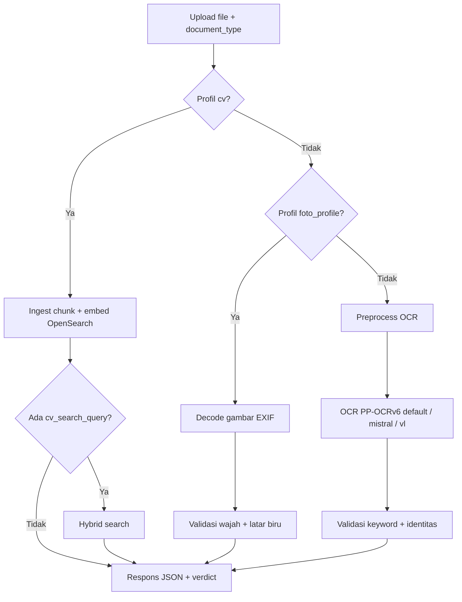

# OCR Platform — API Spec

Spesifikasi HTTP API untuk integrasi frontend (React, mobile, dll.).  
Server default: `http://127.0.0.1:8001` (atur lewat env `PORT`).

Dokumentasi interaktif (Swagger): [`/docs`](http://127.0.0.1:8001/docs)

**Engine OCR default pipeline:** **PP-OCRv6** lokal (`ocr_mode=fast`, tier `medium`). Mode `mistral` (cloud) dan `vl` (PaddleOCR-VL) opsional lewat query `ocr_mode`.

---

## Daftar isi

1. [Konsep umum](#konsep-umum)
2. [Endpoint ringkas](#endpoint-ringkas)
3. [Pipeline utama (disarankan)](#pipeline-utama-disarankan)
4. [Profil dokumen & ketentuan validasi](#profil-dokumen--ketentuan-validasi)
5. [Endpoint per subsistem](#endpoint-per-subsistem)
6. [Struktur respons & verdict](#struktur-respons--verdict)
7. [Kode error](#kode-error)
8. [Variabel lingkungan](#variabel-lingkungan)

---

## Konsep umum

### `document_type`

String yang dikirim klien untuk menentukan **profil validasi**. Server menormalisasi ke ID kanonik (case-insensitive, alias didukung).

| ID kanonik | Label | Mode validasi |
|------------|-------|---------------|
| `ktp` | KTP | OCR + keyword fuzzy |
| `npwp` | NPWP | OCR + keyword fuzzy |
| `kk` | Kartu Keluarga | OCR + keyword fuzzy |
| `rekening` | Rekening | OCR + keyword fuzzy |
| `mutasi` | Mutasi | OCR + keyword fuzzy |
| `skck` | SKCK | OCR + keyword fuzzy |
| `jkn` | JKN (Info Peserta) | OCR + keyword OR + identitas |
| `foto_profile` | Foto Profil | **Gambar** (wajah + latar biru) |
| `cv` | CV | **Ingest + search** (tanpa validasi OCR) |

Daftar lengkap alias ada di [Profil dokumen](#profil-dokumen--ketentuan-validasi).

### Gate validasi (dokumen teks/OCR)

Untuk profil selain `foto_profile`:

```
document_matched = document_type_pass AND (expected_name kosong ATAU identity_pass)
```

| Gate | Default | Arti |
|------|---------|------|
| `document_type_pass` | aggregate ≥ **70%** | Rata-rata skor fuzzy keyword profil vs teks OCR |
| `identity_pass` | skor ≥ **65** | Nama diekstrak dari OCR vs `expected_name` (hanya jika nama diisi) |

Skor identitas = rata-rata `token_sort_ratio`, `WRatio`, `partial_ratio` (RapidFuzz).

### Gate validasi (`foto_profile`)

```
valid = document_matched = face_pass AND blue_background_pass
```

**Tidak ada OCR.** Respons inti cukup field `valid` (boolean). Detail teknis ada di `image_validation` bila perlu debugging. Lihat [Foto Profil](#foto_profile).

### Field penting di respons

| Field | Tipe | Keterangan |
|-------|------|------------|
| `success` | boolean | Request diproses |
| `document_matched` | boolean | Semua gate relevan lolos |
| **`valid`** | boolean | **`foto_profile`:** alias langsung `document_matched` — **VALID / TIDAK VALID** |
| `verdict.summary` | string | Ringkasan bahasa Indonesia |
| `verdict.is_own_document` | bool \| null | `null` jika `expected_name` kosong |
| `verdict.document_type_current` | string \| null | Profil terdeteksi dari OCR/gambar |
| `validation_mode` | `"ocr"` \| `"image"` \| `"cv"` | `"image"` untuk `foto_profile`; `"cv"` untuk ingest CV |

### Engine OCR (`ocr_mode`)

| Nilai | Engine | Keterangan |
|-------|--------|------------|
| **`fast`** (default) | **PP-OCRv6** lokal | Tidak butuh API key; tier lewat `pp_ocr_tier` (default `medium`) |
| `mistral` | Mistral OCR cloud | Butuh `MISTRAL_API_KEY`; mendukung `document_annotation` untuk nama |
| `vl` | PaddleOCR-VL lokal | Layout parsing; set `full_json=true` untuk JSON penuh |

---

## Endpoint ringkas

| Method | Path | Content-Type | Fungsi |
|--------|------|--------------|--------|
| GET | `/health` | — | Health check platform |
| GET | `/api/v1` | — | Daftar endpoint & `document_types` |
| **POST** | **`/api/v1/pipeline`** | **multipart** | **Preprocess → OCR → validasi (1 request)** |
| POST | `/api/v1/preprocess` | multipart | Preprocess gambar saja |
| POST | `/systems/ocr/api/v1/ocr-mistral` | multipart | OCR cloud Mistral (opsional) |
| POST | `/systems/ocr/api/v1/ocr-fast` | multipart | **OCR lokal PP-OCRv6 (default pipeline)** |
| POST | `/systems/ocr/api/v1/ocr` | multipart | OCR lokal PaddleOCR-VL |
| POST | `/systems/validation/api/v1/validate-document` | JSON | Validasi teks OCR vs profil |
| POST | `/systems/validation/api/v1/validate-foto-profile` | multipart | Validasi foto profil biru |
| POST | `/systems/validation/api/v1/compare-names` | JSON | Bandingkan dua string nama |

---

## Pipeline utama (disarankan)

Satu request untuk upload gambar → validasi. Paling cocok untuk form upload di frontend.

### Request

```
POST /api/v1/pipeline
Content-Type: multipart/form-data
```

**Form fields**

| Field | Wajib | Keterangan |
|-------|-------|------------|
| `file` | ✅ | Gambar dokumen (JPEG, PNG, WebP, PDF page, dll.) |
| `document_type` | ✅ | ID kanonik atau alias, mis. `KTP`, `foto_profile` |
| `expected_name` | — | Nama referensi user; kosong = skip cek identitas |

**Query parameters**

| Param | Default | Keterangan |
|-------|---------|------------|
| `ocr_mode` | **`fast`** | **`fast`** = PP-OCRv6 lokal (default) \| `mistral` \| `vl` — **diabaikan untuk `foto_profile`** |
| `pp_ocr_tier` | `medium` | Tier PP-OCRv6 saat `ocr_mode=fast` (default): `balanced` \| `medium` \| `small` \| `tiny` |
| `include_preprocessed_image` | `false` | Sertakan `preprocessed_image.image_base64` |
| `full_json` | `false` | Hanya `ocr_mode=vl`: lampirkan `result_json` penuh |
| `cv_search_query` | — | Hanya `document_type=cv`: kata kunci hybrid search setelah ingest |

Tanpa query `ocr_mode`, pipeline memakai **PP-OCRv6** (`fast`) dengan tier **`medium`**.

### Contoh — KTP + cek nama (default PP-OCRv6)

```bash
curl -X POST "http://127.0.0.1:8001/api/v1/pipeline" \
  -F "file=@KTP_Siti.jpg" \
  -F "document_type=KTP" \
  -F "expected_name=Siti Dwi Sarah"
```

### Contoh — KTP + Mistral OCR (opsional)

```bash
curl -X POST "http://127.0.0.1:8001/api/v1/pipeline?ocr_mode=mistral" \
  -F "file=@KTP_Siti.jpg" \
  -F "document_type=KTP" \
  -F "expected_name=Siti Dwi Sarah"
```

### Contoh — Foto profil biru (tanpa OCR)

```bash
curl -X POST "http://127.0.0.1:8001/api/v1/pipeline" \
  -F "file=@pas_foto.jpg" \
  -F "document_type=foto_profile"
```

Respons `foto_profile`: `ocr: null`, `validation_mode: "image"`, field `image_validation` berisi detail wajah & biru.

### Contoh — CV (ingest + opsional search)

```bash
curl -X POST "http://127.0.0.1:8001/api/v1/pipeline?cv_search_query=pengalaman%20kerja%20python" \
  -F "file=@dataset/cv/cv_Usep_Maulidin.md" \
  -F "document_type=cv"
```

Respons `cv`: `validation_mode: "cv"`, `cv_ingest` (doc_id, chunk_count, parse_mode), `cv_search` bila query diisi. Butuh OpenSearch + `pip install -r requirements-cv.txt`.

### Contoh — JavaScript (fetch)

```javascript
const form = new FormData();
form.append("file", fileInput.files[0]);
form.append("document_type", "ktp");
form.append("expected_name", "Bagus Junda Winata");

const res = await fetch("/api/v1/pipeline", {
  method: "POST",
  body: form,
});
const data = await res.json();

if (data.document_matched) {
  console.log(data.verdict.summary);
} else {
  console.log(data.validation.explanation.detail_lines);
}
```

### Alur internal



---

## Profil dokumen & ketentuan validasi

### Ringkasan per case

| Profil | `document_type` contoh | Wajib isi `expected_name`? | OCR? | Lolos jika |
|--------|------------------------|----------------------------|------|------------|
| KTP | `ktp`, `KTP`, `identitas` | Opsional (disarankan untuk cek milik) | ✅ | Keyword KTP ≥70% **dan** (nama kosong **atau** identitas ≥65) |
| NPWP | `npwp`, `NPWP` | Opsional | ✅ | Keyword NPWP ≥70% **dan** identitas (jika dicek) |
| KK | `kk`, `kartu keluarga` | Opsional | ✅ | Keyword KK ≥70%; nama bisa dari baris tabel anggota |
| Rekening | `rekening`, `rekening tabungan` | Opsional | ✅ | Ada `tabungan`, **tidak** ada `e-statement` |
| Mutasi | `mutasi`, `e-statement` | Tidak dipakai | ✅ | Ada `tabungan` **dan** `e-statement` (tanpa cek nama) |
| SKCK | `skck` | Opsional | ✅ | Ada `skck` / `kepolisian` |
| JKN | `jkn`, `info peserta`, `bpjs kesehatan` | **Disarankan wajib** | ✅ | Ada `info peserta` **atau** `faskes` **dan** identitas ≥65 (jika nama diisi) |
| Foto Profil | `foto_profile`, `pas foto` | Tidak dipakai | ❌ | 1 wajah + latar biru cukup |
| CV | `cv`, `resume`, `curriculum vitae` | Opsional (jadi query search) | ❌ | Ingest sukses ke index; search opsional |

---

### `ktp`

**Alias:** `kartu tanda penduduk`, `id card`, `identitas`

**Keyword yang dicek (fuzzy, rata-rata ≥70%):**

- `nik`, `nama`, `provinsi`, `kabupaten`, `agama`, `kewarganegaraan`, `status perkawinan`

**Bonus skor (structural):**

- NIK 16 digit di OCR
- Kata `nik`

**Identitas:** Ekstraksi nama dari baris `Nama` di OCR; prioritas `holder_name` dari Mistral `document_annotation` bila `ocr_mode=mistral`.

**Tips upload:** Foto kartu fisik — set `PREPROCESS_CARD_WARP=1` agar kartu terisolasi dari latar.

```bash
curl -X POST "http://127.0.0.1:8001/api/v1/pipeline" \
  -F "file=@KTP.jpg" \
  -F "document_type=ktp" \
  -F "expected_name=Nama Lengkap Sesuai KTP"
```

---

### `npwp`

**Alias:** `nomor pokok wajib pajak`, `npwp 16 digit`

**Keyword:** `npwp`, `pajak`, `wajib pajak`

**Bonus:** kata `npwp` di OCR.

```bash
curl -X POST "http://127.0.0.1:8001/api/v1/pipeline" \
  -F "file=@NPWP.jpg" \
  -F "document_type=npwp" \
  -F "expected_name=Nama Wajib Pajak"
```

---

### `kk`

**Alias:** `kartu keluarga`

**Keyword:** `kartu keluarga`, `kepala keluarga`, `nik`

**Identitas khusus:** Bila nama referensi diisi, sistem juga memindai **baris tabel anggota** KK (bukan hanya kepala keluarga).

```bash
curl -X POST "http://127.0.0.1:8001/api/v1/pipeline" \
  -F "file=@KK.jpg" \
  -F "document_type=kk" \
  -F "expected_name=Anggota Keluarga"
```

---

### `rekening`

**Alias:** `rekening koran`, `rekening tabungan`

**Keyword wajib:** `tabungan`

**Keyword terlarang (gagal jika terdeteksi):** `e-statement`

> Rekening tabungan biasa ≠ mutasi/e-statement. Jika OCR mengandung `e-statement`, profil `rekening` **ditolak**.

```bash
curl -X POST "http://127.0.0.1:8001/api/v1/pipeline" \
  -F "file=@Rekening.jpg" \
  -F "document_type=rekening"
```

---

### `mutasi`

**Alias:** `mutasi rekening`, `e-statement`

**Keyword wajib (keduanya):** `tabungan`, `e-statement`

**Identitas:** `expected_name` **tidak** dicek untuk profil mutasi — hanya keyword dokumen.

```bash
curl -X POST "http://127.0.0.1:8001/api/v1/pipeline" \
  -F "file=@Mutasi.jpg" \
  -F "document_type=mutasi"
```

---

### `skck`

**Alias:** `surat keterangan catatan kepolisian`

**Keyword:** `skck`, `kepolisian`

```bash
curl -X POST "http://127.0.0.1:8001/api/v1/pipeline" \
  -F "file=@SKCK.jpg" \
  -F "document_type=skck" \
  -F "expected_name=Nama Pemohon"
```

---

### `jkn`

**Alias:** `jaminan kesehatan nasional`, `bpjs kesehatan`, `info peserta`, `mobile jkn`

**Keyword (minimal satu harus terbaca, fuzzy ≥70%):**

- `info peserta` **atau** `faskes`

**Identitas:** Wajib dicek bila `expected_name` diisi — nama peserta di kartu Mobile JKN (biasanya huruf kapital) dibandingkan dengan referensi.

**Preprocess:** Screenshot aplikasi — isolasi kartu fisik dilewati (sama seperti mutasi/rekening).

```bash
curl -X POST "http://127.0.0.1:8001/api/v1/pipeline" \
  -F "file=@JKN_Info_Peserta.jpg" \
  -F "document_type=jkn" \
  -F "expected_name=Bagus Junda Winata"
```

---

### `foto_profile`

**Alias:** `foto profil`, `foto profile`, `pas foto`, `pass foto`, `passport photo`

**Mode:** `validation_mode: "image"` — **tidak ada OCR**, preprocess kartu dilewati.

**Gate:**

| Gate | Syarat default |
|------|----------------|
| Wajah | Tepat **1** wajah (setelah koreksi orientasi ±90° + isolasi area biru) |
| Ukuran wajah | Area wajah **3%–75%** dari frame analisis |
| Latar biru | ≥ **40%** area sampel di luar wajah (HSV) |

**Catatan upload:** Foto paspor fisik di atas meja putih atau menyamping didukung — server memutar gambar dan mengisolasi region biru terbesar sebelum validasi.

**Field respons utama:**

| Field | Contoh | Arti |
|-------|--------|------|
| `valid` | `true` | **VALID** — wajah + latar biru lolos |
| `valid` | `false` | **TIDAK VALID** |
| `validation.image_validation` | `{ ... }` | Detail gate (opsional untuk UI/debug) |

Respons minimal yang disarankan untuk klien:

```json
{
  "valid": true,
  "document_profile_id": "foto_profile",
  "image_validation": {
    "face_count": 1,
    "face_pass": true,
    "blue_background_pass": true,
    "blue_background_ratio": 0.68
  }
}
```

**Field respons lengkap:** `validation.image_validation`

**Endpoint khusus (tanpa pipeline):**

```bash
curl -X POST "http://127.0.0.1:8001/systems/validation/api/v1/validate-foto-profile" \
  -F "file=@pas_foto.jpg" \
  -F "document_type=foto_profile"
```

**Tuning threshold (env):**

| Env | Default |
|-----|---------|
| `FOTO_PROFILE_MIN_BLUE_RATIO` | `0.40` |
| `FOTO_PROFILE_FACE_MIN_AREA_RATIO` | `0.03` |
| `FOTO_PROFILE_FACE_MAX_AREA_RATIO` | `0.75` |

**Catatan:** `expected_name` **tidak** memvalidasi identitas wajah vs nama (belum ada face recognition). Field diabaikan untuk gate.

---

## Endpoint per subsistem

### Validasi dokumen (JSON — sudah punya teks OCR)

```
POST /systems/validation/api/v1/validate-document
Content-Type: application/json
```

**Body**

```json
{
  "ocr_text": "REPUBLIK INDONESIA\nNIK\n...",
  "document_type": "ktp",
  "expected_name": "Nama Lengkap",
  "aggregate_min_pass_ratio": 0.7,
  "identity_min_score": 65,
  "mistral_annotation": {
    "holder_name": "Nama Lengkap",
    "document_type_label": "KTP"
  }
}
```

| Field | Default | Keterangan |
|-------|---------|------------|
| `aggregate_min_pass_ratio` | `0.7` | Ambang rata-rata keyword (0–1) |
| `identity_min_score` | `65` | Ambang skor identitas 0–100 |
| `mistral_annotation` | null | Opsional; prioritas nama dari Mistral |

> **Jangan** pakai endpoint ini untuk `foto_profile` — butuh gambar, bukan `ocr_text`. Pakai pipeline atau `validate-foto-profile`.

---

### Bandingkan nama saja

```
POST /systems/validation/api/v1/compare-names
Content-Type: application/json
```

```json
{
  "ocr_text": "SITI DWI SARAH",
  "expected_name": "Siti Dwi Sarah",
  "threshold": 85
}
```

Respons: `matched`, `best_score`, `scores`.

---

### Preprocess saja

```
POST /api/v1/preprocess?format=json
Content-Type: multipart/form-data
```

Field: `file`

- `format=image` (default) → PNG grayscale
- `format=json` → metadata + base64

---

### OCR terpisah

| Endpoint | Engine | Catatan |
|----------|--------|---------|
| `POST /systems/ocr/api/v1/ocr-fast?pp_ocr_tier=medium` | **PP-OCRv6 lokal (default pipeline)** | PaddlePaddle; tanpa API key |
| `POST /systems/ocr/api/v1/ocr-mistral` | Mistral cloud | Butuh `MISTRAL_API_KEY` |
| `POST /systems/ocr/api/v1/ocr` | PaddleOCR-VL lokal | Layout parsing |

Alur modular: **preprocess → OCR → validate-document** (3 request) jika tidak pakai pipeline.

---

## Struktur respons & verdict

### Pipeline — dokumen OCR (contoh sukses)

```json
{
  "success": true,
  "ocr_mode": "fast",
  "pp_ocr_tier": "medium",
  "preprocess": { "width": 1200, "height": 800, "card_warped": false },
  "ocr": { "text": "...", "mode": "fast", "model": "PP-OCRv6" },
  "validation": {
    "document_profile_id": "ktp",
    "document_type_pass": true,
    "identity_pass": true,
    "document_matched": true,
    "aggregate_min_pass_ratio": 0.7,
    "keywords": [ { "keyword_raw": "nik", "best_score": 95.0 } ],
    "explanation": {
      "summary": "...",
      "detail_lines": ["..."],
      "primary_blockers": []
    }
  },
  "verdict": {
    "is_own_document": true,
    "document_type_current": "ktp",
    "document_type_current_label": "KTP",
    "document_matched": true,
    "summary": "Dokumen ini adalah KTP milik user saat ini."
  }
}
```

### Pipeline — `foto_profile`

```json
{
  "success": true,
  "valid": true,
  "ocr_mode": null,
  "validation_mode": "image",
  "ocr": null,
  "preprocess": { "skipped": true, "reason": "image_only_profile" },
  "validation": {
    "valid": true,
    "document_profile_id": "foto_profile",
    "document_matched": true,
    "image_validation": {
      "face_count": 1,
      "face_pass": true,
      "blue_background_pass": true,
      "blue_background_ratio": 0.68
    }
  },
  "verdict": {
    "document_type_current": "foto_profile",
    "document_type_current_label": "Foto Profil",
    "summary": "..."
  }
}
```

> Untuk integrasi frontend: cukup baca **`valid`** (`true` = VALID, `false` = TIDAK VALID). Abaikan `ocr` dan teks OCR.

### Interpretasi `verdict.is_own_document`

| Nilai | Arti |
|-------|------|
| `true` | `expected_name` diisi **dan** identitas lolos |
| `false` | `expected_name` diisi **dan** identitas gagal |
| `null` | `expected_name` kosong — kepemilikan belum dicek |

Untuk `foto_profile`, `is_own_document` selalu `null` (identitas dari gambar belum diimplementasi).

---

## Kode error

| HTTP | Situasi | Contoh `detail` |
|------|---------|-----------------|
| 400 | File kosong | `"File kosong."` |
| 400 | `document_type` tidak dikenal | `{ "message": "...", "supported": ["foto_profile", "ktp", ...] }` |
| 400 | OCR tidak menghasilkan teks (pipeline non-foto) | `"OCR tidak menghasilkan teks."` |
| 400 | `ocr_text` kosong (validate-document) | `"ocr_text tidak boleh kosong."` |
| 503 | Mistral belum dikonfigurasi | `{ "code": "MISTRAL_OCR_UNAVAILABLE", ... }` |
| 503 | Paddle/OCR lokal belum siap | `{ "code": "OCR_INFERENCE_UNAVAILABLE", ... }` |

---

## Variabel lingkungan

### Server & CORS

| Env | Default | Fungsi |
|-----|---------|--------|
| `PORT` | `8001` | Port HTTP |
| `CORS_ORIGINS` | `*` | Origin diizinkan (pisah koma) |

### PP-OCRv6 (default pipeline)

| Env | Default | Fungsi |
|-----|---------|--------|
| — | — | Engine default saat `ocr_mode=fast` (query pipeline boleh dihilangkan) |
| `pp_ocr_tier` (query) | `medium` | `balanced` \| `medium` \| `small` \| `tiny` |

### Mistral OCR (opsional, `ocr_mode=mistral`)

| Env | Default |
|-----|---------|
| `MISTRAL_API_KEY` | — (wajib untuk `ocr_mode=mistral`) |
| `MISTRAL_OCR_MODEL` | `mistral-ocr-2512` |
| `MISTRAL_OCR_ANNOTATION` | `1` |

### Preprocess (dokumen kartu)

| Env | Default | Fungsi |
|-----|---------|--------|
| `PREPROCESS_CARD_WARP` | `0` | `1` = isolasi kartu dari latar foto |
| `PREPROCESS_MAX_SIDE` | `2400` | Downscale jika lebih besar |

### Foto profil

| Env | Default |
|-----|---------|
| `FOTO_PROFILE_MIN_BLUE_RATIO` | `0.40` |
| `FOTO_PROFILE_FACE_MIN_AREA_RATIO` | `0.03` |
| `FOTO_PROFILE_FACE_MAX_AREA_RATIO` | `0.75` |

### Observability

| Env | Default |
|-----|---------|
| `LAST_TUNING_LOG_PATH` | `logs/last_tuning.json` |

Log berisi ringkasan request terakhir per subsistem (overwrite tiap panggilan).

---

## Cheat sheet integrasi frontend

| Use case | Endpoint | `document_type` |
|----------|----------|-----------------|
| Upload KTP + cek milik user | `POST /api/v1/pipeline` | `ktp` + `expected_name` |
| Upload NPWP | `POST /api/v1/pipeline` | `npwp` |
| Upload KK anggota | `POST /api/v1/pipeline` | `kk` + `expected_name` |
| Bukti rekening tabungan | `POST /api/v1/pipeline` | `rekening` |
| Mutasi / e-statement | `POST /api/v1/pipeline` | `mutasi` |
| SKCK | `POST /api/v1/pipeline` | `skck` |
| Pas foto biru | `POST /api/v1/pipeline` | `foto_profile` |
| Upload CV + index | `POST /api/v1/pipeline` | `cv` (+ `cv_search_query` opsional) |
| Validasi teks OCR manual | `POST /systems/validation/api/v1/validate-document` | sesuai profil |
| Validasi pas foto saja | `POST /systems/validation/api/v1/validate-foto-profile` | `foto_profile` |

**Decision tree:**

1. Punya **file gambar** → pakai **`/api/v1/pipeline`**
2. Sudah punya **teks OCR** dari engine lain → **`validate-document`**
3. Hanya **foto profil biru** tanpa OCR → **`validate-foto-profile`** atau pipeline dengan `foto_profile`

---

*Versi spec: 1.1 — OCR default pipeline: PP-OCRv6 (`ocr_mode=fast`, tier `medium`).*
